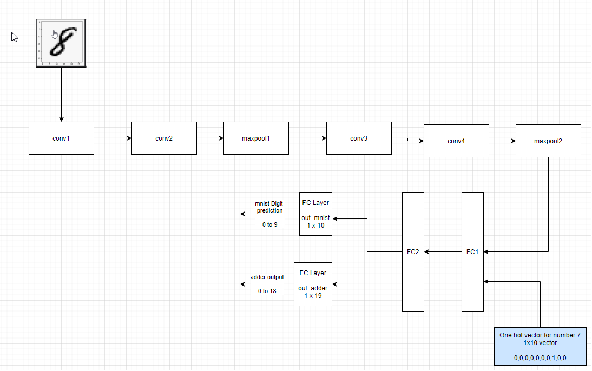
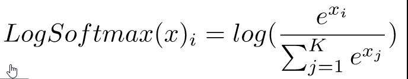
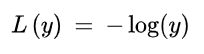

- [1. Neural Network to classify digits and perform addition](#1-neural-network-to-classify-digits-and-perform-addition)
  - [1.1. Model for digit classification and addition](#11-model-for-digit-classification-and-addition)
  - [1.2. data representation](#12-data-representation)
  - [1.3. data generation strategy (basically the class/method you are using for random number generation)](#13-data-generation-strategy-basically-the-classmethod-you-are-using-for-random-number-generation)
  - [1.4. how you have combined the two inputs (basically which layer you are combining)](#14-how-you-have-combined-the-two-inputs-basically-which-layer-you-are-combining)
  - [1.5. mention "what" results you finally got and how did you evaluate your results](#15-mention-what-results-you-finally-got-and-how-did-you-evaluate-your-results)
  - [1.6. must mention what loss function you picked and why!](#16-must-mention-what-loss-function-you-picked-and-why)
  - [1.7. training MUST happen on the GPU](#17-training-must-happen-on-the-gpu)
  - [1.8. short training log](#18-short-training-log)

# 1. Neural Network to classify digits and perform addition

## 1.1. Model for digit classification and addition

  

Model description

- MNIST image if fed to a CNN (convolutional neural network).  Input image is `28x28x1`
- After the forward pass inside the CNN, the output is `7x7x16` (see network code comments below for size at each layer)
- The output `7x7x16` is flattened/reshaped to `1 x 784`
- The digit to be added is encoded as one hot vector.  Since the digit ranges from 0 to 9, the size of the one hot vector is `1 x 10`: each element of the vector represents a digit from 0 to 9.
- Both the one hot vector and the image vector are concatenated to create a `1x794` and this is fed to a fully connected layer FC1
- There are 2 outputs from the fully connected network
  - an output layer to predict MNIST digits.  The output size is 1x10 (for 10 digits)
  - another output layer to represent the result of addition.  the output size is 1x19 (to represent numbers from 0 to 18)

Shown below is the implementation of the model, along with the sizes at every layer. this class defines the CNN and the fully connected layers..

```
class Net(nn.Module):
    def __init__(self):
        super(Net, self).__init__()
        # shown below are the definitions of the layers of the network

        # input = 28x28x1 | kernels = (3x3x1)x8 | output = 28x28x8  | RF = 3x3
        self.conv1 = nn.Conv2d(in_channels=1, out_channels=8, kernel_size=3, padding=1) #input -? OUtput? RF
        
        # input = 28x28x8 (padding=1) | kernels = (3x3x32)x16 | output = 28x28x16 | RF = 5x5
        self.conv2 = nn.Conv2d(in_channels=8, out_channels=16, kernel_size=3, padding=1)
        
        # input = 28x28x16 | maxpool = 2x2 | output = 14x14x16 | RF = 10x10
        self.pool1 = nn.MaxPool2d(kernel_size=2, stride=2)
        
        # input = 14x14x16 (padding=1) | kernels = (3x3x64)16 | output = 14x14x16 | RF = 12x12
        self.conv3 = nn.Conv2d(in_channels=16, out_channels=16, kernel_size=3, padding=1)
        
        # input = 14x14x16 (padding=1) | kernels = (3x3x128)x16 | output = 14x14x16 | RF = 14x14
        self.conv4 = nn.Conv2d(in_channels=16, out_channels=16, kernel_size=3, padding=1)
        
        # input = 14x14x16 | maxpool = 2x2 | output = 7x7x16 | RF = 28x28
        self.pool2 = nn.MaxPool2d(kernel_size=2, stride=2)
        
        # # input = 7x7x64 | kernel = (3x3x256)x128 | output = 5x5x128 | RF=30x30
        # self.conv5 = nn.Conv2d(in_channels=16, out_channels=16, kernel_size=3)
        
        # # input = 5x5x128 | kernel = (3x3x512)x256 | output = 3x3x256 | RF=32x32
        # self.conv6 = nn.Conv2d(in_channels=16, out_channels=16, kernel_size=3)
        
        # # input = 3x3x256 | kernel = (3x3x1024)x10 | output = 1x1x10 | RF=34x34
        # self.conv7 = nn.Conv2d(in_channels=16, out_channels=10, kernel_size=3)

        # input = 794 | output = 120 
        self.fc1 = nn.Linear(in_features=7*7*16 + 10, out_features=120)
        # input = 120 | output = 60
        self.fc2 = nn.Linear(in_features=120, out_features=60)

        # this is the output layer for mnist
        # input = 60 | output = 10
        self.out_mnist = nn.Linear(in_features=60, out_features=10)

        # this is the output layer for the adder
        # input=60 | output=19 (max sum of two digits=18)
        self.out_adder = nn.Linear(in_features=60, out_features=19)

    def forward(self, mnist, num):
        global once

        # seems to define the forward propogation of the neural network
        mnist = self.pool1(F.relu(self.conv2(F.relu(self.conv1(mnist)))))
        mnist = self.pool2(F.relu(self.conv4(F.relu(self.conv3(mnist)))))

        # x = F.relu(self.conv6(F.relu(self.conv5(x))))
        # #x = F.relu(self.conv7(x))
        # x = self.conv7(x)
        # x = x.view(-1, 10)
        # return F.log_softmax(x)

        # hidden fc1 linear layer
        #if once: print(f"mnist.shape after maxpool2={mnist.shape}")
        mnist = mnist.reshape(-1, 7*7*16)
        # Concatenating one hot encoding of input2 digit to FC layer
        mnist_and_num = torch.cat((mnist, num), dim=1) 
        #if once: print(f"mnist_and_num.shape after torch.cat()={mnist_and_num.shape}")
        mnist_and_num = F.relu(self.fc1(mnist_and_num))

        # hidden fc2 linear layer
        mnist_and_num = F.relu(self.fc2(mnist_and_num))

        # output linear layer
        mnist = self.out_mnist(mnist_and_num)
        mnist_num_sum = self.out_adder(mnist_and_num)

        return F.log_softmax(mnist), F.log_softmax(mnist_num_sum)
        #return mnist, mnist_num_sum
```

## 1.2. data representation
- The input image is a tensor of size `28x28x1`.  
- The digit to be added is encoded as a one hot vector of size `1x10` to allow representation of digits from 0 to 9 (10 digits)
- The output of the mnist predictor is 1x10 (to predict digits 0 to 9)
- The output of the adder network is 1x19 ( to predict addition result from 0 to 18)

## 1.3. data generation strategy (basically the class/method you are using for random number generation)

`torch.randint()` is used to generate the random digits used as input for the number to be added.  Code belows shows this and the encoding of the digit as a one hot vector

```python
        # generate random ints
        # Returns a tensor filled with random integers generated uniformly between low (inclusive) and high (exclusive).
        rand_digits = torch.randint(low=0, high=10, size=(batch_size,)) # batch_size rand ints
        # Takes LongTensor with index values of shape (*) and returns a tensor of shape (*, num_classes) that have zeros everywhere except where the index of last dimension matches the corresponding value of the input tensor, in which case it will be 1.
        rand_digits_one = F.one_hot(rand_digits, num_classes=10) # one hot encoding
        rand_digits_one = rand_digits_one.to(device)
        rand_digits = rand_digits.to(device)        
```

## 1.4. how you have combined the two inputs (basically which layer you are combining)

- The image is fed through a CNN for feature extraction.  The output of the CNN is `7x7x16`, which is reshaped to `1x784`
- The input digit to be added is represented as a one hot vector with size `1x10`
- These two vectors are concatenated and fed as an input to the fully connected layer.

Shown below is the code that does the concatenation

```python
        #if once: print(f"mnist.shape after maxpool2={mnist.shape}")
        mnist = mnist.reshape(-1, 7*7*16)
        # Concatenating one hot encoding of input2 digit to FC layer
        mnist_and_num = torch.cat((mnist, num), dim=1) 
```

## 1.5. mention "what" results you finally got and how did you evaluate your results

- The output of the MNIST classifier is a `1x10` vector.  This can represent the 10 digits from 0 to 9
- The output of the adder network is a `1x19` vector, which is capable of representing the 19 numbers from 0 to 18 (possible results of the addition)

The above outputs were converted to the actual prediction using argmax().  The following code shows how this was done

```python
output, summation = model(data, rand_digits_one)   # predict using the model for the given data (batch); for each batch, output.shape=torch.Size([128, 10]); for last batch it is output.shape=torch.Size([96, 10])
.
.
.
pred_mnist = output.argmax(dim=1, keepdim=True)  # get the index of the max log-probability using argmax(); this index represents the predicted digit

```

## 1.6. must mention what loss function you picked and why!

Negative Log Likelihood loss function was chosen as the loss function since it is well suited for multi classification problems due to the following reasons:

- for multi-classification problems, softmax converts the output vector to a vector of normalized probability distribution.  Thhis vector consists of probabilities proportional to the expontials of the elements of the output vector.  During this process, softmax also scales up / adds separation to the value predicted by the network.
- NLL takes the softmax scores (likelihood scores) and converts it to a loss.  The NLL output is large (loss is large) when the softmax likelihood is small for a class.  It is small (loss is small) when the softmax likelyhood is large for a class..

  

  

## 1.7. training MUST happen on the GPU

Training was done on a GPU

```python
torch.__version__
torch.cuda.get_device_name()
torch.cuda.get_device_properties('cuda:0')

_CudaDeviceProperties(name='Tesla P100-PCIE-16GB', major=6, minor=0, total_memory=16280MB, multi_processor_count=56)
```

## 1.8. short training log

Training was done for 50 epochs.  Output shown below for the last 5 epochs
```
.
.
.
Epoch: 46
Training phase: batch_id=59; total loss=0.8265974521636963; mnist loss=0.029581133276224136; adder loss=0.7970163226127625; epoch_mnist_correct=59471/60000; epoch_sum_correct=42646/60000: 100%|██████████| 60/60 [00:08<00:00,  6.68it/s]
Training set: Average mnist loss: 0.0000; mnist Accuracy: 59471/60000   99.1183%; adder Accuracy: 42646/60000   71.0767%
Testing phase: total_test_loss=8419.704275131226; total_correct=9903/10000; total_sum_correct=7812/10000: 100%|██████████| 10/10 [00:01<00:00,  6.28it/s]
Test set: Average loss: 0.0317, Accuracy: 9903/10000 (99%)

Epoch: 47
Training phase: batch_id=59; total loss=0.8263429999351501; mnist loss=0.027625655755400658; adder loss=0.7987173199653625; epoch_mnist_correct=59486/60000; epoch_sum_correct=43884/60000: 100%|██████████| 60/60 [00:09<00:00,  6.58it/s]
Training set: Average mnist loss: 0.0000; mnist Accuracy: 59486/60000   99.1433%; adder Accuracy: 43884/60000   73.1400%
Testing phase: total_test_loss=8177.347946166992; total_correct=9913/10000; total_sum_correct=7809/10000: 100%|██████████| 10/10 [00:01<00:00,  6.62it/s]
Test set: Average loss: 0.0302, Accuracy: 9913/10000 (99%)

Epoch: 48
Training phase: batch_id=59; total loss=0.8106864094734192; mnist loss=0.024420911446213722; adder loss=0.78626549243927; epoch_mnist_correct=59510/60000; epoch_sum_correct=43809/60000: 100%|██████████| 60/60 [00:08<00:00,  6.72it/s]
Training set: Average mnist loss: 0.0000; mnist Accuracy: 59510/60000   99.1833%; adder Accuracy: 43809/60000   73.0150%
Testing phase: total_test_loss=8517.124522209167; total_correct=9910/10000; total_sum_correct=7240/10000: 100%|██████████| 10/10 [00:01<00:00,  6.64it/s]
Test set: Average loss: 0.0304, Accuracy: 9910/10000 (99%)

Epoch: 49
Training phase: batch_id=59; total loss=0.8316329121589661; mnist loss=0.019724559038877487; adder loss=0.8119083642959595; epoch_mnist_correct=59515/60000; epoch_sum_correct=46566/60000: 100%|██████████| 60/60 [00:08<00:00,  6.69it/s]
Training set: Average mnist loss: 0.0000; mnist Accuracy: 59515/60000   99.1917%; adder Accuracy: 46566/60000   77.6100%
Testing phase: total_test_loss=8539.1895236969; total_correct=9903/10000; total_sum_correct=6907/10000: 100%|██████████| 10/10 [00:01<00:00,  6.63it/s]
Test set: Average loss: 0.0323, Accuracy: 9903/10000 (99%)

Epoch: 50
Training phase: batch_id=59; total loss=0.8966447114944458; mnist loss=0.02803477644920349; adder loss=0.8686099052429199; epoch_mnist_correct=59511/60000; epoch_sum_correct=44550/60000: 100%|██████████| 60/60 [00:09<00:00,  6.63it/s]
Training set: Average mnist loss: 0.0000; mnist Accuracy: 59511/60000   99.1850%; adder Accuracy: 44550/60000   74.2500%
Testing phase: total_test_loss=8044.346004486084; total_correct=9899/10000; total_sum_correct=7603/10000: 100%|██████████| 10/10 [00:01<00:00,  6.68it/s]Test set: Average loss: 0.0338, Accuracy: 9899/10000 (99%)
``` 